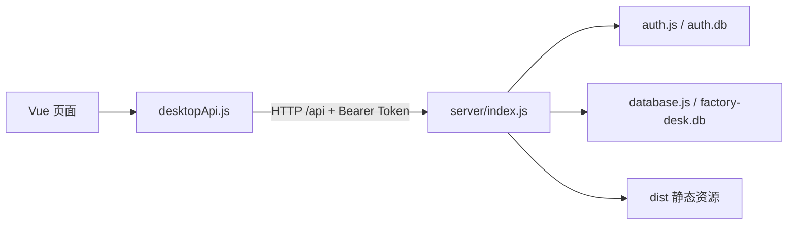

# 项目总览

本说明根据 2026-09-21 工作区源码整理，2026-09-30 补充对账与打印模块，当前主线为 Factory Desk V2 Web 版。包名仍为 `factory-desktop-manager`，`package.json` 版本为 `0.1.0`；“V2”是项目文档中的架构名称。

## 目录与职责

```text
henfeng/
├── README.md                    项目入口与本地运行
├── src/
│   ├── main.js                  Vue、路由与 Element Plus 初始化
│   ├── App.vue                  导航、登录态入口、全局刷新与通知
│   ├── router/index.js          Hash 路由及登录/管理员页面守卫
│   ├── views/                   登录和十二个业务页面
│   ├── components/              表单弹窗、确认弹窗、内容卡片、图标、空状态和单据预览（DocumentPreview）
│   ├── composables/
│   │   ├── useAppData.js        共享业务数据与刷新方法
│   │   ├── useViewState.js      页面筛选、搜索及排序状态
│   │   ├── useWideScreen.js     宽屏判断（手机上表格操作列不固定）
│   │   └── useNotifier.js       提示消息
│   ├── lib/desktopApi.js        Web HTTP 客户端、会话、导出与打印
│   ├── utils/                   Excel 字段映射、日期/数字/金额格式、单据打印 HTML（printDocuments.js）
│   └── styles.css              全局样式
├── server/
│   ├── index.js                HTTP 路由、鉴权入口和静态资源服务
│   ├── database.js             业务表、迁移、库存联动、计价和统计
│   ├── operations.js           客户、收款、台账、作废、价格生效及增量迁移
│   ├── backups.js              在线快照、自动备份、校验与保护恢复
│   ├── auth.js                 用户、密码、会话、登录限流与管理员校验
│   ├── errors.js               错误到 HTTP 状态码的映射（400/401/403/409/429/500）
│   ├── storage.js              数据目录创建及旧业务库路径迁移
│   ├── documents.js            对账单/出货单/退胚单取数、校验、合计及打印抬头设置
│   ├── documentExport.js       按模板样式生成单据 Excel（分页、合并单元格、纸张尺寸）
│   └── templates/document-styles.xlsx  单据 Excel 样式模板
├── shared/businessTypes.js     前后端共用：六个业务类型标签、批次汇总与校验规则
├── shared/documents.js         前后端共用：单据类型、默认抬头、纸张规格、分单规则
├── Dockerfile                  应用镜像（两阶段构建，非 root 运行）
├── docker-compose.yml          生产部署：nginx（80/443）+ app（仅内部网络）+ certbot（按需）
├── .dockerignore               构建上下文排除依赖、数据和私密文件
├── deploy/                     Nginx 配置：限流区、公共安全片段；docker/ 下为容器用站点模板，nginx-factory*.conf 为宿主机（PM2）站点
├── ecosystem.config.cjs        PM2 单进程配置（敏感配置从 /opt/factory-desk/factory.env 读取）
├── deploy/factory.env.example  服务器 factory.env 模板（旧的 .env.production.example 已不再使用）
├── DEPLOY_SERVER.md            现有部署流程
├── docs/                       架构、登录存储和现状说明
├── tests/                      原业务回归、新模块回归及 HTTP 集成测试
├── electron/                   旧桌面版主进程、IPC、数据库及导出
├── scripts/full-backup.mjs      整机备份：业务库 + 账号库 + 设置，在线备份并校验
├── .factory-server-data/       本地运行数据
├── dist/                       前端构建产物
├── release/                    历史发布归档
└── node_modules/               已安装依赖
```

`desktopApi.js` 保留了旧命名，但当前实现统一使用 `fetch` 访问 Web API。`electron/` 依赖的 Electron 未列在当前依赖和启动脚本中，不能视为已接通的第二种运行方式。

## 请求与数据流



前端使用 Vue 响应式模块保存共享状态，没有额外引入 Pinia 或 Vuex。页面进入及显式刷新会重新请求服务端；多设备共享同一数据库，当前没有 WebSocket 或服务端推送。

## 页面与业务流程

| 路由 | 文件 | 主要职责 |
| --- | --- | --- |
| `/login` | `src/views/LoginView.vue` | 登录 |
| `/` | `src/views/DashboardView.vue` | 指标、预警和最近单据 |
| `/price-sheets` | `src/views/PriceSheetsView.vue` | 物料与辅助价目维护 |
| `/inbound-orders` | `src/views/InboundOrdersView.vue` | 收货（正常入库、退胚回库）、客户退货（不良退回），不计金额 |
| `/outbound-orders` | `src/views/OutboundOrdersView.vue` | 成品出货、退胚、返工出货和库存扣减；退胚/返工出货选原批次；勾选明细跳转打印 |
| `/bills` | `src/views/BillsView.vue` | 出库对账与结算状态，可跳转生成对账单 |
| `/documents` | `src/views/DocumentsView.vue` | 生成客户对账单、出货单、退胚单，打印预览与 Excel 导出 |
| `/inventory` | `src/views/InventoryView.vue` | 库存余额、流水和盘点 |
| `/customers` | `src/views/CustomersView.vue` | 客户档案和余额 |
| `/receipts` | `src/views/ReceiptsView.vue` | 逐笔收款和作废 |
| `/backups` | `src/views/BackupsView.vue` | 管理员备份与恢复 |
| `/reports` | `src/views/ReportsView.vue` | 月度出货金额趋势、按业务类型标签的月度数量 |
| `/users` | `src/views/UserManagementView.vue` | 管理员账号与系统设置 |

浏览器实际地址采用 Hash 形式，例如 `/#/inbound-orders`。除登录页外都需要登录，用户管理与备份恢复页还需要管理员角色。

业务主流程是“客户/物料建档 → 收货 → 退胚 → 出货 → 退货/返工出货 → 对账 → 收款”，库存台账同步记录变动，管理员管理备份。

- 价格按生效日期取用，未来价格不提前启用，历史账单保留开单价。
- 账单作废留档且不重建；收款自动更新未收余额与状态，有收款时保护关联出货记录。
- 出入库撤销冲回库存，保留原始记录；盘点检查并发库存变化。
- 客户名称与账期应用于新单据，历史账单快照保留。
- 默认业务时区 `Asia/Shanghai`，前后端共用服务端业务日期口径。
- 入库标签：正常入库、退胚回库（收货）、不良退回（客户退货），入库不计金额。出库标签：成品出货（开账）、退胚、返工出货（免费、不开账）。
- 批次 = 客户 + 物料 + 加工单号。每次新增、修改、撤销后在同一事务内复核：退胚合计 ≤ 收货 − 成品出货，返工出货合计 ≤ 不良退回（`server/database.js` 的 `assertBatches`，规则在 `shared/businessTypes.js`）。
- 对账单只取有效应收账单，金额使用开单快照；出货单（含返工出货）和退胚单按客户、日期、单号、类型分单打印。

具体约束、旧数据迁移和导出范围见 [业务操作说明](BUSINESS_WORKFLOWS.md)。

## 存储与核心数据表

默认根目录为项目下的 `.factory-server-data/`，可通过 `FACTORY_STORAGE_ROOT` 覆盖。

| 位置 | 内容 |
| --- | --- |
| `business/factory-desk.db` | 业务库 |
| `auth/auth.db` | 账号与会话库 |
| `backups/` | 在线业务备份、保护副本及自动备份配置 `settings.json` |
| `exports/` | 导出预留目录，当前浏览器导出不写入此目录 |

两套 SQLite 数据库都启用 WAL。工作区中的 `.db-wal`、`.db-shm` 属于数据库运行文件。

| 数据表 | 职责与关系 |
| --- | --- |
| `inventory_items` | 物料编码、规格、镀种、厂商相关字段、数量、库位和参考单价 |
| `stock_orders` | `type` 区分入库/出库，`business_type` 保存六个业务类型标签之一，`item_id` 关联物料；每条记录对应一个物料 |
| `price_sheets` | 物料单价历史、生效日期和启用标志，`item_id` 关联物料 |
| `bills` | 数量、开单单价、金额和结算状态快照，`stock_order_id` 唯一关联出库单 |
| `customers` | 客户档案、账期、启停；历史单据通过客户 ID 归集 |
| `receipts` | 账单收款、整数分金额、幂等请求、作废字段 |
| `inventory_ledger` | 每次库存变化、操作后结余、原因与操作人 |
| `bill_events` | 账单及收款操作历史 |
| `app_settings` | 编码规则、一次性迁移标记，以及打印抬头 `printSettings`（JSON） |
| `users`（认证库） | 账号、角色、密码哈希和启停状态 |
| `sessions`（认证库） | Token 哈希、用户、到期及撤销时间 |

业务库初始化会执行兼容迁移、补充编号默认值、为缺失账单的出库单补账。旧账单迁移保留原金额，补充 `quantity` 和 `unit_price` 快照，重复启动不会重算已有快照。Web 版首次启动不调用历史示例数据函数。旧结清状态迁移为独立历史结清金额，库存按升级时余额期初结转。HTTP 服务升级旧库前先创建保护备份，日常备份与恢复由管理员接口提供。

## 接口索引

下表路径均以 `/api` 为前缀，`:id` 为数字 ID。除健康检查、登录和注销当前 Token 外，接口都要求有效会话。业务校验失败返回 400，未登录 401，无权限 403，数据冲突 409，登录限流 429，服务器内部错误 500（只返回通用提示，详情写入服务日志）。用户管理、编号设置、业务重置、备份恢复、撤销历史结清和修改打印抬头还校验管理员权限（`/api/admin/*` 统一校验）。

| 用途 | 方法与路径 |
| --- | --- |
| 健康与会话 | `GET /health`、`POST /auth/login`、`GET /auth/me`、`POST /auth/logout` |
| 初始配置与总览 | `GET /bootstrap`、`GET /dashboard` |
| 物料 | `GET/POST /inventory`、`PUT/DELETE /inventory/:id` |
| 入库/出库查询 | `GET /inbound-orders`、`GET /outbound-orders` |
| 业务单据 | `GET/POST /stock-orders`、`GET/PUT/DELETE /stock-orders/:id` |
| 物料单价 | `GET/POST /material-prices`、`PUT/DELETE /material-prices/:id` |
| 单价兼容路由 | `GET/POST /price-sheets`、`PUT/DELETE /price-sheets/:id` |
| 账单 | `GET/POST /bills`、`PUT/DELETE /bills/:id`、`GET /bills/summary` |
| 原子保存物料/价目 | `POST /material-prices/save` |
| 库存流水/盘点 | `GET /inventory-ledger`、`POST /inventory-adjustments` |
| 客户 | `GET/POST /customers`、`PUT /customers/:id` |
| 收款 | `GET/POST /receipts`、`POST /receipts/:id/void` |
| 账单记录/恢复 | `GET /bills/:id/events`、`POST /bills/:id/restore`；`DELETE /bills/:id` 为填写原因作废 |
| 撤销历史结清 | `POST /admin/bills/:id/clear-legacy` |
| 打印抬头 | `GET /print-settings`、`PUT /admin/print-settings`（管理员） |
| 单据预览/导出 | `POST /documents/preview` 返回单据 JSON；`POST /documents/export` 返回 `.xlsx` 附件 |
| 备份管理 | `GET/POST /admin/backups`、`PUT /admin/backups/settings`、`POST /admin/backups/upload` |
| 备份下载/恢复 | `GET /admin/backups/:backupId/download`、`POST /admin/backups/:backupId/restore` |
| 用户管理 | `GET/POST /users`、`PUT /users/:id/password`、`PUT /users/:id/status` |
| 编号规则 | `GET/PUT /admin/numbering-settings` |
| 业务重置 | `POST /admin/reset-business-data`，备份后清空业务记录（含客户、流水、收款），保留账号及编号设置 |

普通已登录用户可以操作业务接口，当前没有按客户、仓库或用户隔离业务数据。出入库、单价、账单查询支持 `startDate` / `endDate`；通用单据查询另支持 `type`。列表没有服务端分页，关键词搜索主要在前端完成。

## 环境变量与配置来源

| 变量 | 使用位置 | 代码默认值/含义 |
| --- | --- | --- |
| `FACTORY_SHARED_HOST` | 服务端 | `127.0.0.1`（只允许本机 Nginx 访问；生产环境由 `ecosystem.config.cjs` 固定） |
| `FACTORY_BUSINESS_TIMEZONE` | 服务端/前端业务日期 | `Asia/Shanghai`，有效 IANA 时区 |
| `FACTORY_SHARED_PORT` | 服务端 | `8787` |
| `FACTORY_STORAGE_ROOT` | 服务端 | 项目根目录下 `.factory-server-data` |
| `FACTORY_SHARED_DATA_DIR` | 服务端 | 旧存储目录变量，仅在未设置 `FACTORY_STORAGE_ROOT` 时使用 |
| `FACTORY_ADMIN_USERNAME` | 账号初始化 | `admin` |
| `FACTORY_ADMIN_PASSWORD` | 账号初始化 | 仅在对应用户名不存在时设置初始密码 |
| `FACTORY_ADMIN_DISPLAY_NAME` | 账号初始化 | `系统管理员` |
| `FACTORY_SESSION_TTL_HOURS` | 服务端 | `168` 小时 |
| `FACTORY_CORS_ORIGIN` | 服务端 | 空 = 不发送跨域头；仅当网页与接口不同源时填写允许的来源 |
| `FACTORY_TRUSTED_PROXIES` | 服务端 | 除本机外，可信任其 `X-Real-IP` 的反向代理地址（逗号分隔的 IPv4 或网段）；Docker 部署中为 nginx 容器 `172.31.240.10`，写错时拒绝启动 |
| `FACTORY_ENV_FILE` | PM2 配置 | `/opt/factory-desk/factory.env`，存放管理员初始密码等敏感配置 |
| `FACTORY_OFFSITE_DIR` / `FACTORY_OFFSITE_KEEP` | 整机备份脚本 | `/opt/factory-desk/offsite` / 保留 `30` 份 |
| `NODE_ENV` | 服务端 | `production` 时，首次创建管理员必须提供至少 10 位的非默认密码 |
| `VITE_FACTORY_API_BASE_URL` | Vite 前端 | 默认当前页面源下的 `/api`；开发代理指向 `127.0.0.1:8787`，可指定其他 API 地址 |

服务端直接读取 `process.env`，没有自动加载 `.env` 的代码。Docker 部署由 `docker-compose.yml` 通过 `env_file` 读取服务器上的 `factory.env`（模板为 `deploy/factory.env.example`），并覆盖监听地址、数据目录等项；PM2 部署则由 `ecosystem.config.cjs` 读取同一文件。Vite 变量在开发服务启动或构建时读取，修改生产前端的 API 地址需要重新构建。

## 相关说明

- [本地运行与命令](../README.md)
- [登录、账号和存储](LOGIN_AND_STORAGE.md)
- [现状与待办](PROJECT_STATUS.md)
- [服务器部署](../DEPLOY_SERVER.md)
